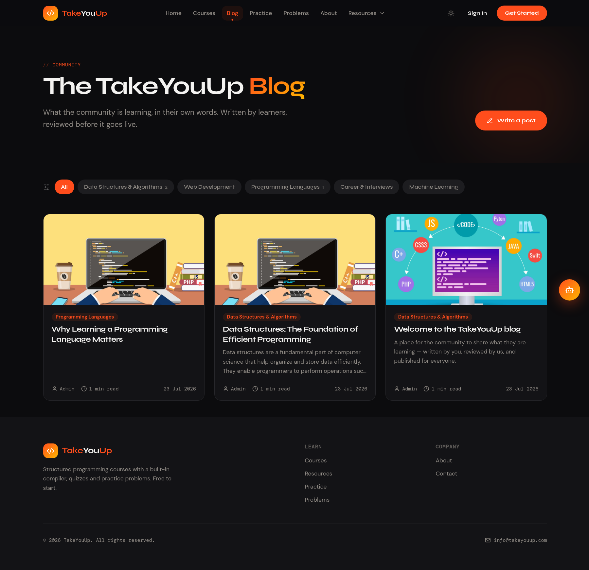
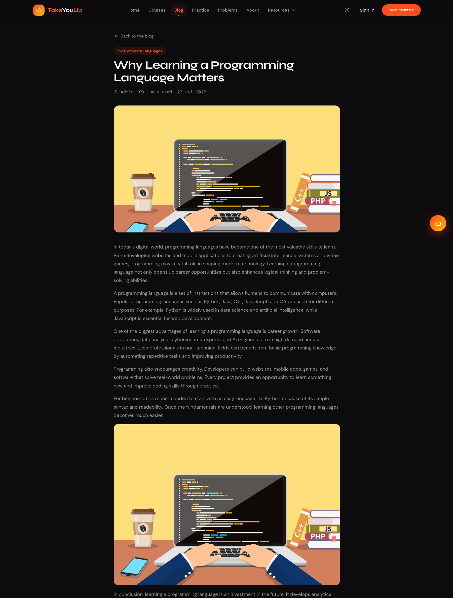
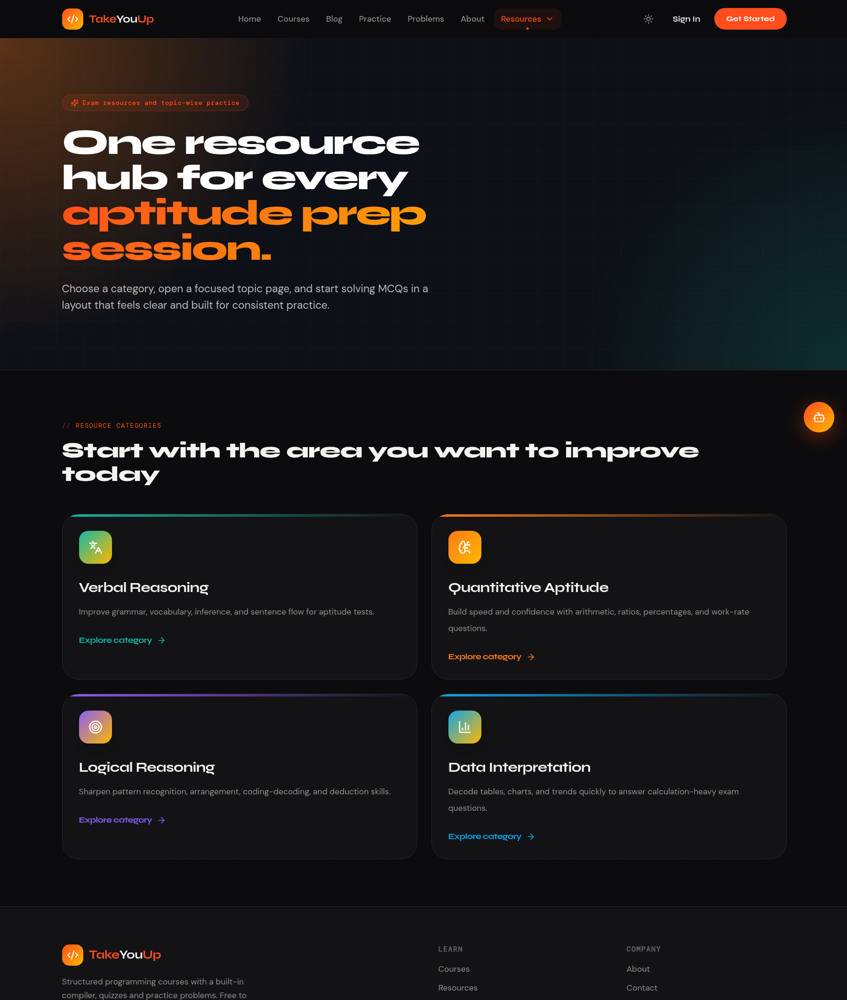
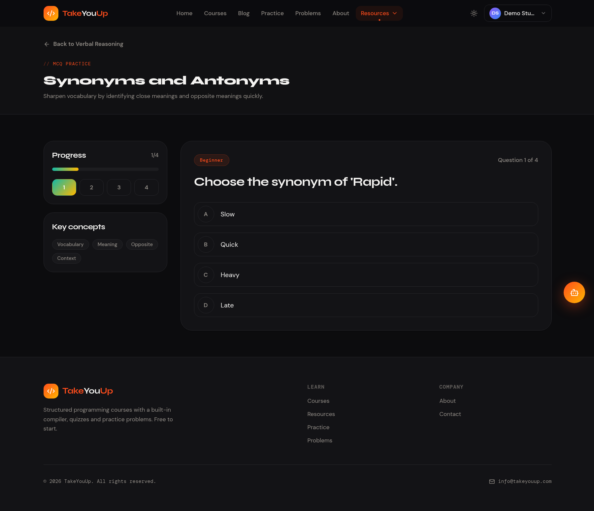
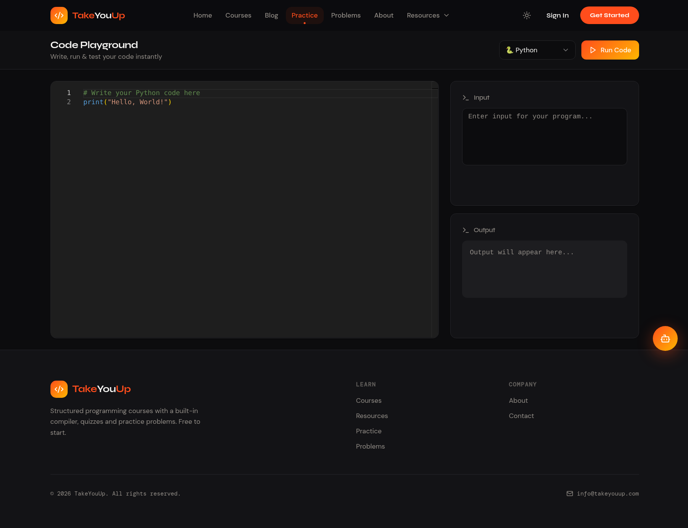
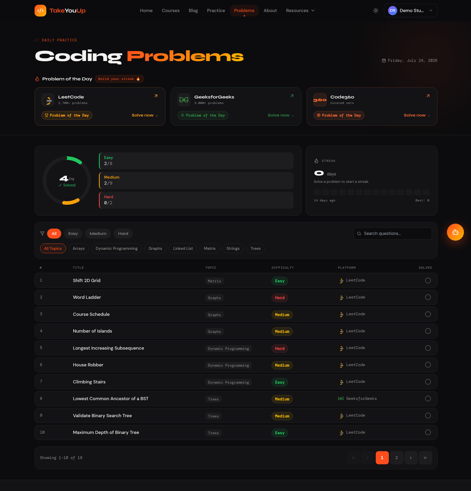

<div align="center">


# 🚀 TakeYouUp

### _Master Programming. Crack Interviews. Build Your Future._

A full-stack ed-tech platform where developers level up through structured courses, an in-browser code editor, live quizzes, an aptitude practice hub, a community blog with editorial review, an AI assistant, and verifiable certificates — all in one place.

<br/>

[](https://react.dev)
[](https://www.typescriptlang.org)
[](https://vitejs.dev)
[](https://tailwindcss.com)
[](https://spring.io/projects/spring-boot)
[](https://openjdk.org)
[](https://www.mysql.com)
[](https://www.docker.com)

<br/>

[🐳 Quick Start](#-run-with-docker-recommended) · [✨ Features](#-features) · [📸 Screenshots](#-screenshots) · [🐛 Report Bug](../../issues)

<br/>


</div>

---

## 📸 Screenshots

| | |
| :---: | :---: |
| **🏠 Home** <br/>  | **📚 Courses** <br/>  |
| **📖 Lesson + Live Compiler** <br/>  | **✍️ Community Blog** <br/>  |
| **📰 Blog Article** <br/>  | **🧠 Aptitude Resources** <br/>  |
| **❓ MCQ Practice** <br/>  | **💻 Online Compiler** <br/>  |
| **🧩 Coding Problems** <br/>  | **🤖 AI Assistant** <br/>  |

---

## ✨ Features

### 🎓 Learn

- **Structured course catalog** — browse by category (Programming, Development, AI/ML), each course a module-and-lesson syllabus with per-lesson progress tracking.
- **In-lesson code, runnable** — Markdown lessons with fenced code blocks that get syntax highlighting and a **Run** button that executes right there via the online compiler.
- **Live quizzes** — per-course quizzes graded **server-side**, with instant feedback and a saved attempt history.
- **Verifiable certificates** — earn a certificate once a course is 100 % complete; anyone can verify it by serial number **without logging in**.

### 🧠 Aptitude Resources

- **Topic-wise MCQ practice** across Quantitative Aptitude, Data Interpretation, Logical Reasoning and Verbal Reasoning.
- **Focused practice flow** — one question at a time, the correct answer with a worked explanation, a progress tracker, and an end-of-set score.

### ✍️ Community Blog

- **Anyone can write** — any signed-in user can draft a post in Markdown with a cover image and inline images.
- **Editorial review workflow** — posts go **Draft → Pending → Published** (or **Rejected** with a reason); nothing is public until an admin approves it.
- **Re-review on edit** — editing a published post automatically sends it back to pending, so live content is always reviewed.
- **Topic filtering, SEO & sitemap** — shareable topic filters, `BlogPosting` structured data, and blog URLs in the sitemap.

### 💻 Practice

- **In-browser code editor** — a Monaco-powered online compiler to write and run code with no local setup.
- **Coding problems** — a curated problem set (login required).

### 🤖 AI & Personalization

- **AI assistant** — a context-aware chatbot (Google Gemini via the Spring Boot backend) for course and programming questions.
- **Dark / light mode** — a fully persistent theme toggle across every page.
- **Layout-matched loading skeletons** — every page shows a shimmer shaped like its real content, so nothing reflows when data lands.

### 🔐 Auth & Admin

- **JWT auth with refresh tokens** — short-lived access token + long-lived refresh token, auto-refreshed on the client.
- **Email verification & password reset** — token-based flows (emails viewable locally via Mailpit).
- **Protected routes** — lessons, problems, profile, certificates and the blog editor require login.
- **Admin dashboard** — `/admin` manages courses, quizzes, the DSA question bank, resource content, and blog moderation.

---

## 🛠️ Tech Stack

### Frontend

| Technology | Purpose |
| --- | --- |
| **React 18 + TypeScript** | UI library with type safety |
| **Vite 5** | Build tool & dev server |
| **Tailwind CSS 3** | Utility-first styling |
| **shadcn/ui + Radix UI** | Accessible component primitives |
| **React Router v6** | Client-side routing (lazy-loaded routes) |
| **TanStack Query v5** | Server state & data fetching |
| **Axios** | HTTP client with JWT interceptors |
| **Monaco Editor** | In-browser code editor |
| **highlight.js** | Code syntax highlighting in lessons/blog |
| **React Hook Form + Zod** | Form management & validation |
| **Lucide React** | Icon library |
| **Syne · DM Mono · DM Sans** | Custom typography |

### Backend

| Technology | Purpose |
| --- | --- |
| **Spring Boot 4 (Java 21)** | REST API framework |
| **Spring Security 7 + JWT** | Authentication, refresh tokens & role-based access |
| **Spring Data JPA** | ORM & database access |
| **MySQL 8.4** | Relational database |
| **Flyway** | Versioned schema migrations |
| **Google Gemini** | AI assistant responses |
| **Maven** | Build & dependency management |

### Infrastructure

| Technology | Purpose |
| --- | --- |
| **Docker Compose** | One-command full-stack orchestration |
| **nginx** | Serves the SPA & reverse-proxies the API |
| **Mailpit** | Local SMTP capture for dev emails |
| **Adminer** | Lightweight DB console |
| **GitHub Actions** | CI: build & test backend, frontend, and Docker images |

---

## 🐳 Run with Docker (recommended)

The entire stack — MySQL, the Spring Boot API, the React SPA, Mailpit, and an
Adminer DB console — runs with a single command. No local Java, Node, or MySQL
required.

```bash
git clone https://github.com/Abhishek0732/TakeYouUp-LMS.git
cd TakeYouUp-LMS
cp .env.example .env      # optional: add your own Gemini/SMTP keys
docker compose up -d --build
```

| Service | URL |
| --- | --- |
| 🖥️ Frontend | http://localhost:5174 |
| ⚙️ Backend API | http://localhost:8082 |
| ❤️ Health | http://localhost:8082/actuator/health |
| 📬 Mailpit (dev inbox) | http://localhost:8026 |
| 🗄️ Adminer | http://localhost:8083 (server `db`, user `root`, pass `takeyouup`) |

**Seeded demo accounts** (created automatically on first boot):

| Role | Email | Password |
| --- | --- | --- |
| Admin | `admin@takeyouup.com` | `admin1234` |
| User | `student@takeyouup.com` | `student1234` |

The schema is created and versioned by **Flyway** migrations
(`takeyouup-backend/src/main/resources/db/migration`), and starter content
(courses, lessons, quizzes, the DSA question bank, aptitude resources, and a
welcome blog post) is inserted by idempotent seeders (`seed/`). Ports,
credentials, and API keys are all configurable in `.env`.

**Works on any host.** The React app talks to the API using **relative** URLs
that nginx proxies to the backend, so the same build works at
`http://localhost:5174`, a LAN address like `http://192.168.1.9:5174`, or a real
domain — no rebuild, nothing hardcoded. Cover images are served locally from
`/uploads`, so there are no external image dependencies.

**Your data persists.** MySQL data (`db_data`) and uploaded files
(`uploads_data`) live in named Docker volumes and survive `up`, `down`, and
restarts. The seeders only fill empty tables, so they never overwrite anything
you create. Data is wiped **only** if you explicitly run `down -v`.

```bash
docker compose logs -f backend      # follow API logs
docker compose up -d --build frontend   # rebuild just the SPA after UI changes
docker compose down                 # stop containers (KEEPS data)
docker compose down -v              # stop AND wipe the database (fresh start)
```

---

## 🚀 Getting Started (manual / without Docker)

### Prerequisites

- **Node.js** ≥ 18 · **npm** ≥ 9 — [Download](https://nodejs.org)
- **Java** 21 (JDK) — [Download](https://adoptium.net)
- **Maven** 3.9+ (or use the bundled `./mvnw` wrapper)
- **MySQL** 8.x running locally

### 1. Backend (Spring Boot)

```bash
cd takeyouup-backend
./mvnw spring-boot:run
```

The API starts on **`http://localhost:8080`**. Configure the datasource, JWT
secret, and Gemini key in `src/main/resources/application.properties` (or via
environment variables — see below).

### 2. Frontend (React + Vite)

```bash
cd takeyouup-frontend
npm install
npm run dev
```

The SPA is served at **`http://localhost:5173`**. It calls `/api` relative to
its own origin; set `VITE_API_URL` if your backend lives elsewhere.

### 3. Production build

```bash
cd takeyouup-frontend
npm run build      # type-checks (tsc) then bundles with Vite
npm run preview    # preview the production build locally
```

---

## 📁 Project Structure

```
TakeYouUp-LMS/
├── docker-compose.yml           # Full stack: db, backend, frontend, mailpit, adminer
├── .env.example                 # Ports, credentials, JWT & Gemini config
├── screenshots/                 # README media
├── takeyouup-backend/
│   └── src/main/
│       ├── java/takeyouup/example/takeyouup/
│       │   ├── controller/      # REST controllers (auth, courses, blog, quizzes, …)
│       │   │   └── blog/        # Blog: public, author, admin & topic controllers
│       │   ├── service/         # Business logic (incl. blog review workflow)
│       │   ├── model/           # JPA entities
│       │   ├── repository/      # Spring Data repositories
│       │   ├── dto/             # Request/response DTOs
│       │   ├── config/          # Spring Security & app config
│       │   ├── security/        # JWT filter, token providers
│       │   └── seed/            # Idempotent content seeders
│       └── resources/
│           ├── application.properties
│           └── db/migration/    # Flyway migrations (V1…Vn)
└── takeyouup-frontend/
    └── src/
        ├── api/                 # Axios instance + typed API clients
        │   ├── axios.ts  auth.ts  courses.ts  blog.ts
        │   ├── resources.ts  profile.ts  execute.ts  stats.ts
        ├── components/
        │   ├── ui/              # shadcn/ui primitives
        │   ├── blog/            # BlogCard, PostStatusBadge, …
        │   ├── admin/           # Admin panels (blog moderation, editors)
        │   ├── Navbar.tsx  Footer.tsx  Chatbot.tsx
        │   ├── RichContent.tsx  # Markdown renderer (code + images)
        │   └── Skeletons.tsx    # Layout-matched loading skeletons
        ├── context/             # AuthContext, CourseContext, ProgressContext
        ├── pages/               # Home, Courses, CourseDetail, CourseOverview,
        │                        # Blog, BlogPost, BlogEditor, MyPosts,
        │                        # Resources, ResourceCategory, ResourceTopic,
        │                        # CodeEditor, CodingQuestions, Certificates,
        │                        # Profile, Admin, auth pages, …
        ├── hooks/               # Custom hooks (useSeo, useSiteContent, …)
        ├── App.tsx              # Router & providers
        └── main.tsx
```

---

## 🌐 API Overview

All protected routes require an `Authorization: Bearer <token>` header. Content
mutations require the `ADMIN` role; author actions require login.

| Method | Endpoint | Description | Auth |
| --- | --- | --- | :---: |
| `POST` | `/api/auth/register` · `/login` · `/refresh` | Register, login, refresh token | ❌ |
| `GET` | `/api/auth/verify` · `POST /api/auth/reset-password` | Email verify & password reset | ❌ |
| `GET` | `/api/courses` · `/api/courses/overview/{slug}` | Course catalog & syllabus | ❌ |
| `GET` | `/api/courses/slug/{slug}` | Full course with lesson bodies | ✅ |
| `POST` | `/api/execute` | Run code in the online compiler | ❌ |
| `POST` | `/api/quizzes/attempts` · `GET /attempts/mine` | Grade a quiz & list attempts | ✅ |
| `GET` | `/api/progress/courses/{id}/summary` | Course completion % | ✅ |
| `POST` | `/api/certificates/courses/{id}` | Issue a certificate (course 100 %) | ✅ |
| `GET` | `/api/certificates/verify/{serial}` | Publicly verify a certificate | ❌ |
| `GET` | `/api/resources/categories` · `/{slug}` · `/topics/{topic}` | Aptitude categories & MCQs | ❌ |
| `GET` | `/api/blog/posts` · `/posts/{slug}` · `/topics` | Public blog listing & articles | ❌ |
| `*` | `/api/blog/me/**` | Author: draft, submit, edit, upload images | ✅ |
| `*` | `/api/blog/admin/**` | Admin: approve / reject / delete posts | 👑 |
| `POST` | `/api/chatbot/generate` | AI assistant response (Gemini) | ✅ |
| `PUT` | `/api/users/update-name` · `POST /api/contacts` | Profile & contact form | ✅ |

👑 = requires `ADMIN` role.

---

## ⚙️ Environment Variables

Everything is configured through `.env` (see `.env.example`):

```env
# Ports
DB_HOST_PORT=3308
BACKEND_HOST_PORT=8082
FRONTEND_HOST_PORT=5174
ADMINER_HOST_PORT=8083
MAILPIT_UI_PORT=8026

# Database
MYSQL_DATABASE=takeyouup
MYSQL_ROOT_PASSWORD=takeyouup

# JPA / migrations
JPA_DDL_AUTO=validate
SPRING_FLYWAY_ENABLED=true

# Auth
JWT_SECRET=change-me-to-a-long-random-string
JWT_EXPIRATION_MS=3600000
REQUIRE_VERIFIED_EMAIL=false

# AI assistant (Google Gemini)
GEMINI_API_KEY=
GEMINI_MODEL=gemini-3-flash-preview

# Mail
MAIL_FROM=no-reply@takeyouup.local
```

> The frontend needs no build-time config for Docker (it uses relative `/api`
> URLs). For the manual dev server, set `VITE_API_URL` if the backend is not on
> the same origin.

---

## 🎨 Design System

TakeYouUp uses a custom design system on top of Tailwind CSS and shadcn/ui.

| Token | Value | Usage |
| --- | --- | --- |
| `--orange` | `#ff4d1c` | Primary accent, CTAs, active states |
| `--gold` | `#ffb800` | Gradient partner, highlights |
| `--ink` | `#0c0c0e` | Dark backgrounds, hero sections |
| **Syne** | Display font | Headings & titles |
| **DM Mono** | Monospace | Labels, badges, metadata |
| **DM Sans** | Body font | Paragraphs & UI text |

Dark and light modes are fully supported across every page via CSS variables and
a persistent theme toggle.

---

## 🔐 Security & Platform Notes

| Area | What it does |
| --- | --- |
| **Role-based access** | Content mutations (courses, quizzes, DSA bank, resources, blog moderation) require `ADMIN`; normal users get `403`. Reads and user actions need only login. |
| **Refresh tokens** | Short-lived access token + long-lived refresh token; the client auto-refreshes on `401` via `/api/auth/refresh`. |
| **Blog review workflow** | Posts are public only after admin approval; editing a published post sends it back to pending automatically. Uploads are auth-gated. |
| **Login throttling** | Repeated failed logins per email are rate-limited (`429`). |
| **Email verification** | Registration issues a verification token; enforcement is off by default (`REQUIRE_VERIFIED_EMAIL=true` to require it). |
| **Consistent errors** | A global handler returns proper `400/401/403/404/409/429` with a structured body instead of `500`s. |
| **Tests + CI** | Backend unit tests plus a GitHub Actions pipeline that builds & tests the backend, frontend, and both Docker images. |

---

## 🗺️ Roadmap

- [x] JWT auth with refresh tokens & email verification
- [x] Certificates on course completion (with public verification)
- [x] Admin dashboard for courses, quizzes & content
- [x] Aptitude resources with topic-wise MCQ practice
- [x] Community blog with editorial review workflow
- [ ] Discussion threads per lesson
- [ ] Student leaderboard & XP system
- [ ] Payment integration for premium courses
- [ ] Video lesson support (embedded player)
- [ ] Mobile app (React Native)

---

## 🤝 Contributing

1. **Fork** the repository
2. **Create** a feature branch: `git checkout -b feature/amazing-feature`
3. **Commit** your changes: `git commit -m 'feat: add amazing feature'`
4. **Push** to the branch: `git push origin feature/amazing-feature`
5. **Open** a Pull Request

Please follow the existing code style and make sure your changes don't break
existing functionality.

---

## 📄 License

Licensed under the **MIT License** — see the [LICENSE](LICENSE) file for details.

---

## 👨‍💻 Author

**Abhishek Kumar Verma**

[](https://linkedin.com/in/abhishekverma32)
[](https://github.com/Abhishek0732)
[](mailto:info@takeyouup.com)

---

<div align="center">

Made with ❤️ by Abhishek Kumar Verma

⭐ **Star this repo if you found it helpful!** ⭐

</div>
