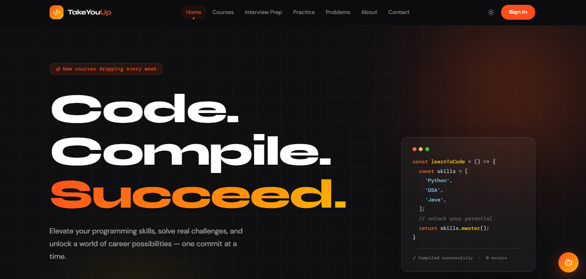
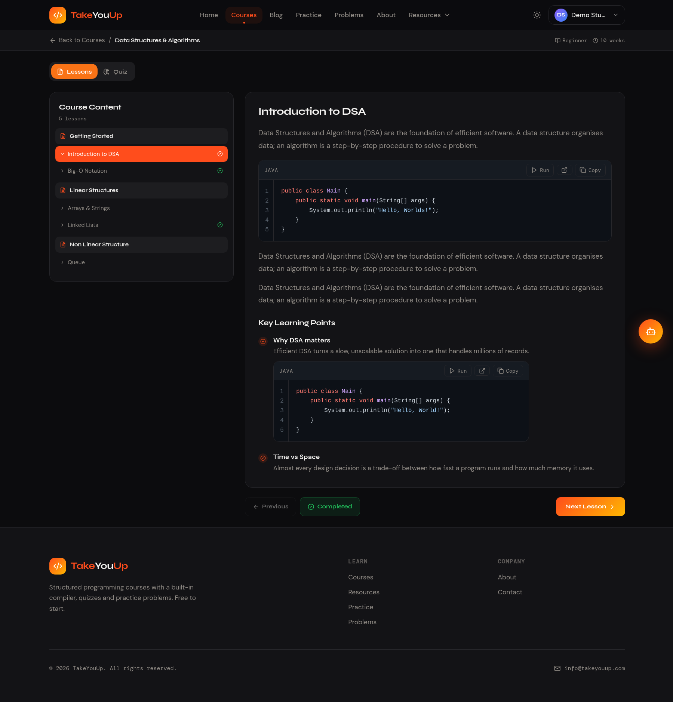
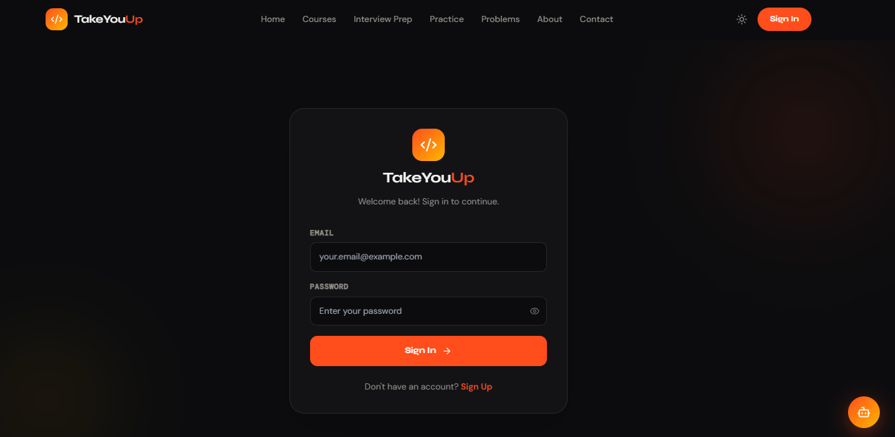
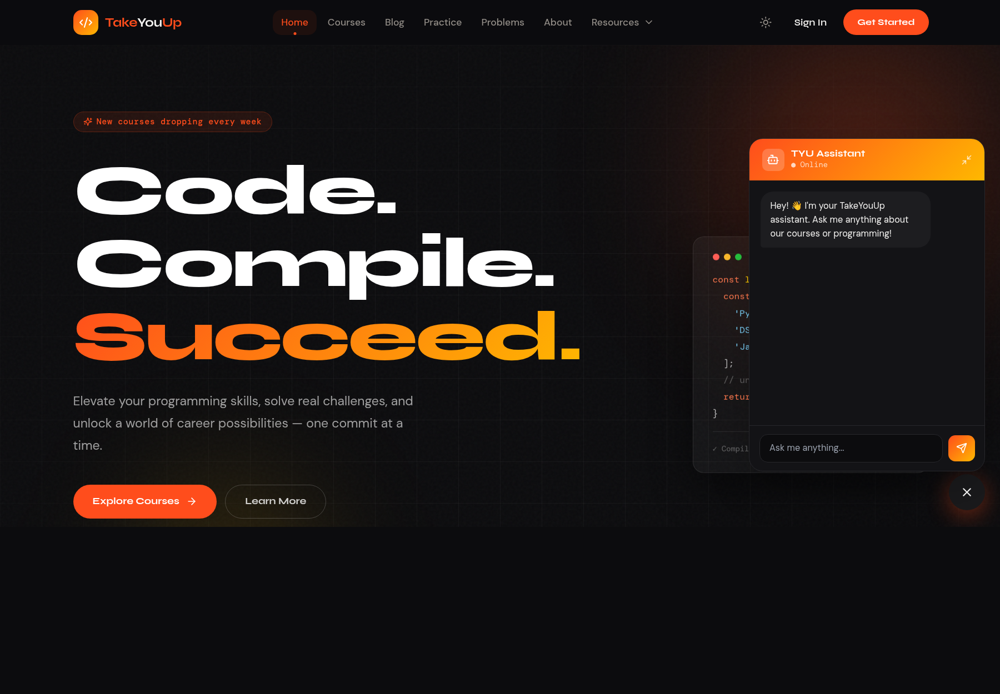

<div align="center">


# 🚀 TakeYouUp

### *Master Programming. Crack Interviews. Build Your Future.*

A full-stack ed-tech platform where developers level up through structured courses, real-world projects, interview prep question banks, an in-browser code editor, an AI chatbot, and live quizzes — all in one place.

<br/>

[](https://react.dev)
[](https://www.typescriptlang.org)
[](https://vitejs.dev)
[](https://tailwindcss.com)
[](https://spring.io/projects/spring-boot)
[](https://openjdk.org)

<br/>

[🌐 Live Demo](#) · [🐛 Report Bug](../../issues) · [✨ Request Feature](../../issues)

</div>

---

## 📸 Screenshots

> **Add your screenshots here** — replace the placeholder paths below with actual images from your project.
> Recommended: take screenshots of Home, Courses, Course Detail, Interview Prep, and Login pages.

| Page | Preview |
|------|---------|
| 🏠 **Home — Hero** |  |
| 📚 **Courses Page** |  |
| 📖 **Course Detail** |  |
| 🔐 **Login / Signup** |  |
| 🤖 **AI Chatbot** |  |

> 💡 **Tip:** Create a `/screenshots` folder in your repo root and add PNG/JPG images there. GitHub renders them automatically in the README.

---

## ✨ Features

### 🎓 Learning
- **Structured Course Catalog** — Browse courses by category (Programming, Development, AI/ML)
- **Lesson-by-Lesson Navigation** — Module-based sidebar with progress tracking per lesson
- **Live Quizzes** — Topic-specific quizzes for DSA, Java, and Python with instant feedback
- **Interview Prep Bank** — Curated question sets for DSA, Python, Java, OOPS, React, DBMS

### 💻 Practice
- **In-Browser Code Editor** — Monaco-powered online compiler to write and run code without setup
- **Coding Problems** — Curated coding challenges (protected — login required)

### 🤖 AI & Personalization
- **AI Chatbot** — Context-aware chatbot powered by your Spring Boot backend for course queries
- **Dark / Light Mode** — Fully persistent theme toggle across the entire app

### 🔐 Auth & Profiles
- **JWT Authentication** — Secure login / signup with token-based sessions
- **User Profile** — View and edit display name, protected by auth middleware
- **Protected Routes** — Course detail, problems, and profile pages require login

---

## 🛠️ Tech Stack

### Frontend
| Technology | Purpose |
|---|---|
| **React 18** | UI library |
| **TypeScript** | Type safety |
| **Vite** | Build tool & dev server |
| **Tailwind CSS** | Utility-first styling |
| **shadcn/ui + Radix UI** | Accessible component primitives |
| **React Router v6** | Client-side routing |
| **TanStack Query** | Server state & data fetching |
| **Axios** | HTTP client |
| **Monaco Editor** | In-browser code editor |
| **Lucide React** | Icon library |
| **React Hook Form + Zod** | Form management & validation |
| **Syne + DM Mono + DM Sans** | Custom Google Fonts typography |

### Backend
| Technology | Purpose |
|---|---|
| **Spring Boot** | REST API framework |
| **Java** | Backend language |
| **JWT (JSON Web Tokens)** | Authentication & authorization |
| **Spring Security** | Route protection & token validation |
| **Spring Data JPA** | ORM & database access |
| **REST API** | Course, Auth, Contact, Chatbot, User endpoints |

---

## 📁 Project Structure

```
takeyouup-frontend/
├── public/                     # Static assets
├── src/
│   ├── api/                    # Axios instance & auth API calls
│   │   ├── auth.ts
│   │   └── axios.ts
│   ├── assets/                 # Images & static media
│   ├── components/
│   │   ├── ui/                 # shadcn/ui component library
│   │   ├── Navbar.tsx          # Responsive sticky navbar
│   │   ├── Footer.tsx          # Site footer
│   │   ├── Chatbot.tsx         # Floating AI chatbot widget
│   │   ├── QuizSection.tsx     # Interactive quiz component
│   │   └── ThemeProvider.tsx   # Dark/light mode context
│   ├── context/
│   │   ├── AuthContext.tsx     # Global auth state (user, login, logout)
│   │   └── CourseContext.jsx   # Course data fetching context
│   ├── data/                   # Static course & quiz data
│   │   ├── dsaCourse.js
│   │   ├── javaCourse.js
│   │   ├── pythonCourse.js
│   │   ├── machineLearningCourse.js
│   │   ├── systemDesignCourse.js
│   │   ├── webDevCourse.js
│   │   ├── dsaInterview.js
│   │   └── quizzes/
│   │       ├── dsaQuiz.ts
│   │       ├── javaQuiz.ts
│   │       └── pythonQuiz.ts
│   ├── hooks/                  # Custom React hooks
│   ├── pages/
│   │   ├── Home.tsx            # Landing page
│   │   ├── Courses.tsx         # Course catalog with filtering
│   │   ├── CourseDetail.tsx    # Lesson viewer + quiz tabs
│   │   ├── InterviewPrep.tsx   # Interview question catalog
│   │   ├── InterviewPrepDetail.tsx  # Interview question viewer
│   │   ├── About.tsx           # About page with team & stats
│   │   ├── Contact.tsx         # Contact form
│   │   ├── CodeEditor.tsx      # Monaco-powered compiler
│   │   ├── CodingQuestions.tsx # Problem set (protected)
│   │   ├── Login.tsx           # Login page
│   │   ├── SignUp.tsx          # Registration page
│   │   ├── Profile.tsx         # User profile (protected)
│   │   └── NotFound.tsx        # 404 page
│   ├── routes/
│   │   └── ProtectedRoute.tsx  # Auth guard wrapper
│   ├── lib/
│   │   └── utils.ts
│   ├── App.tsx                 # Root router & providers
│   ├── main.tsx
│   └── index.css               # Global styles & design tokens
├── .env                        # Environment variables
├── package.json
├── tailwind.config.ts
├── tsconfig.json
└── vite.config.ts
```

---

## 🚀 Getting Started

### Prerequisites

Make sure you have the following installed:

- **Node.js** >= 18.x — [Download](https://nodejs.org)
- **npm** >= 9.x (comes with Node)
- **Java** >= 17 (for backend) — [Download](https://adoptium.net)
- **Maven** or **Gradle** (for Spring Boot backend)

---

### 1. Clone the Repository

```bash
git clone https://github.com/Abhishek0732/TakeYouUp-LMS.git
cd TakeYouUp-LMS
```

---

### 2. Backend Setup (Spring Boot)

```bash
# Navigate to the backend directory
cd backend

# Build and run with Maven
./mvnw spring-boot:run

# OR with Gradle
./gradlew bootRun
```

The backend API will start on **`http://localhost:8080`**

> Make sure your database is configured in `src/main/resources/application.properties` or `application.yml`

---

### 3. Frontend Setup (React + Vite)

```bash
# Navigate to the frontend directory
cd takeyouup-frontend

# Install dependencies
npm install

# Create environment file
cp .env.example .env
```

Edit `.env` and set your backend URL:

```env
VITE_API_URL=http://localhost:8080
```

```bash
# Start the development server
npm run dev
```

The frontend will be available at **`http://localhost:5173`**

---

### 4. Build for Production

```bash
# Frontend production build
cd takeyouup-frontend
npm run build

# Preview the production build locally
npm run preview
```

---

## 🌐 API Endpoints

The frontend communicates with the Spring Boot backend through these endpoints:

| Method | Endpoint | Description | Auth Required |
|--------|----------|-------------|:---:|
| `POST` | `/api/auth/register` | Register new user | ❌ |
| `POST` | `/api/auth/login` | Login & get JWT token | ❌ |
| `GET` | `/api/courses` | Fetch all courses | ❌ |
| `GET` | `/api/courses/slug/:slug` | Fetch course by slug | ✅ |
| `PUT` | `/api/users/update-name` | Update display name | ✅ |
| `POST` | `/api/contacts` | Submit contact form | ✅ |
| `POST` | `/api/chatbot/generate` | AI chatbot response | ✅ |

> All protected routes require the `Authorization: Bearer <token>` header.

---

## ⚙️ Environment Variables

### Frontend (`.env`)

```env
VITE_API_URL=http://localhost:8080
```

### Backend (`application.properties`)

```properties
# Server
server.port=8080

# Database (configure your DB here)
spring.datasource.url=jdbc:mysql://localhost:3306/takeyouup
spring.datasource.username=root
spring.datasource.password=yourpassword

# JWT
jwt.secret=your_jwt_secret_key
jwt.expiration=86400000
```

---

## 🎨 Design System

TakeYouUp uses a custom design system built on top of Tailwind CSS and shadcn/ui:

| Token | Value | Usage |
|-------|-------|-------|
| `--orange` | `#ff4d1c` | Primary accent, CTAs, active states |
| `--gold` | `#ffb800` | Gradient partner, ratings |
| `--ink` | `#0c0c0e` | Dark backgrounds, hero sections |
| **Syne** | Display font | All headings & titles |
| **DM Mono** | Monospace font | Labels, badges, metadata |
| **DM Sans** | Body font | Paragraphs & UI text |

Dark mode is fully supported across all pages using CSS variables and the `ThemeProvider` context.

---

## 🤝 Contributing

Contributions are welcome! Here's how to get started:

1. **Fork** the repository
2. **Create** a feature branch: `git checkout -b feature/amazing-feature`
3. **Commit** your changes: `git commit -m 'feat: add amazing feature'`
4. **Push** to the branch: `git push origin feature/amazing-feature`
5. **Open** a Pull Request

Please follow the existing code style and make sure your changes don't break existing functionality.

---

## 📋 Roadmap

- [ ] Payment integration for premium courses
- [ ] Video lesson support (embedded player)
- [ ] Discussion forums per course
- [ ] Student leaderboard & XP system
- [ ] Certificate generation on course completion
- [ ] Mobile app (React Native)
- [ ] Admin dashboard for course management

---

## 🐛 Known Issues

- Chatbot requires the backend AI service to be running; displays an error message if unavailable
- Some static fallback course data is used when the backend API is unreachable

---

## 📄 License

This project is licensed under the **MIT License** — see the [LICENSE](LICENSE) file for details.

---

## 👨‍💻 Author

**Abhishek Kumar Verma**

[](https://linkedin.com/in/abhishekverma32)
[](https://github.com/Abhishek0732)
[](mailto:info@takeyouup.com)

---

<div align="center">

Made with ❤️ by Abhishek Kumar Verma

⭐ **Star this repo if you found it helpful!** ⭐

</div>